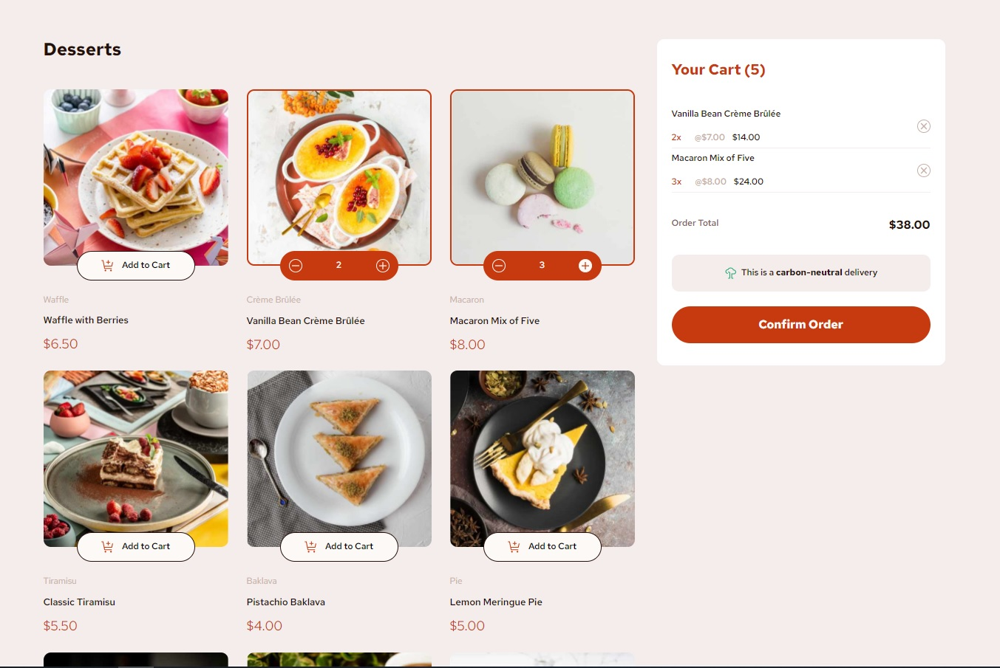
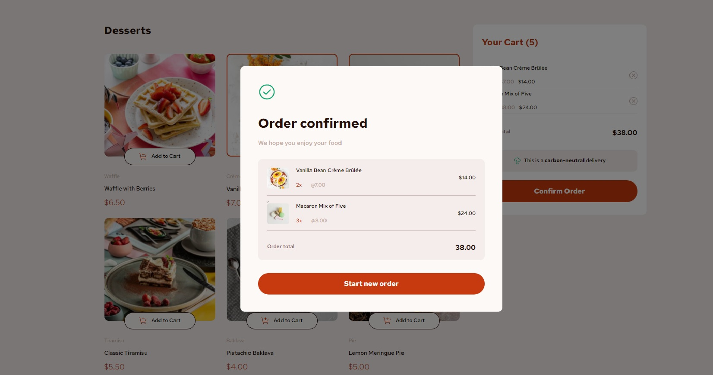

# Product list with cart solution

## Table of contents

- [Overview](#overview)
  - [The challenge](#the-challenge)
  - [Screenshot](#screenshot)
  - [Links](#links)
- [My process](#my-process)
  - [Built with](#built-with)
  - [What I learned](#what-i-learned)

## Overview

### The challenge

Users should be able to:

- Add items to the cart and remove them
- Increase/decrease the number of items in the cart
- See an order confirmation modal when they click "Confirm Order"
- Reset their selections when they click "Start New Order"
- View the optimal layout for the interface depending on their device's screen size
- See hover and focus states for all interactive elements on the page

### Screenshot

### Links

- Solution URL: [Add solution URL here](https://github.com/VitaliySaburdo/Product-list-with-cart)
- Live Site URL: [Add live site URL here](https://product-list-with-cart-two.vercel.app/)

## My process

### Built with

- Semantic HTML5 markup
- SASS (mixins)
- BEM
- CSS variables
- CSS custom properties
- Flexbox
- CSS Grid
- Mobile-first workflow
- JS

### What I learned

Setting up a collector based on vite vanilla js. Mastered deployment on vercel. Reusing styles in a
project. Adaptive layout. The use of images with adaptation to the screens of different devices.
Using mixins in a project. Naming by BEM.
